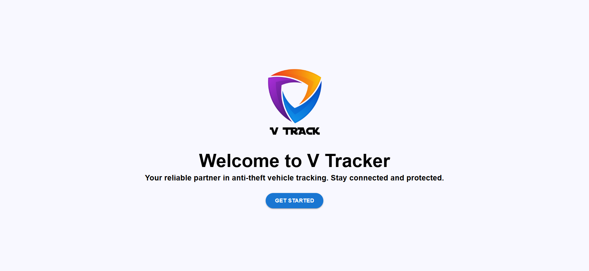
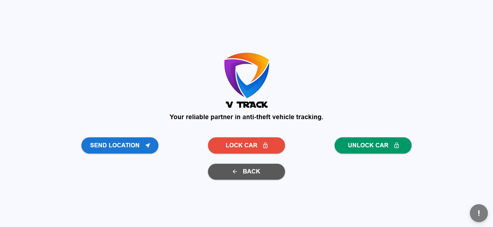
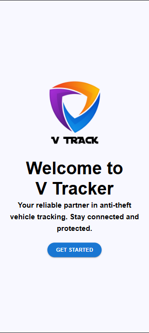
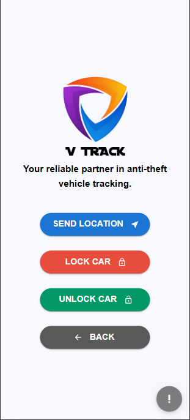

# Anti-Theft Vehicle Tracking System

## Project Overview

**V Tracker** is an innovative anti-theft vehicle tracking system that allows users to securely track and control their vehicles remotely. The application offers a set of essential features for vehicle security, ensuring the safety of the vehicle in case of theft or emergency.

The app is designed to handle key security functions for vehicles, including sending the location, locking the vehicle, and unlocking it when needed.

## App Name: V Tracker

### Key Features:

1. **Send Location of the Car**:

   - Allows the user to send the current location of the vehicle for tracking purposes, ensuring quick location retrieval in case of theft.

2. **Lock the Car**:

   - Provides functionality to remotely lock the car, enhancing its security by preventing unauthorized access.

3. **Unlock the Car**:

   - Enables remote unlocking of the vehicle when authorized, allowing easy access for the owner in case they need to retrieve the vehicle.

---

## Project Section for DEEE 3rd-Year Project

### Objective

This project is developed as part of the **3rd-Year Engineering Electronics and Electrical Engineering (DEEE)** curriculum. The primary objective is to create a system that enhances vehicle security by providing real-time tracking and remote control features through a mobile or web application.

---

### Technologies Used:

- **Frontend**: React.js, Vite, TypeScript, Material-UI
- **Backend**: Node.js, Express (if applicable)
- **Database**: Firebase (for location tracking, car status, etc.) or any other database
- **APIs**: Google Maps API (for location services)
- **Other Tools**: Git, GitHub, npm (package manager)

---

### Installation

#### 1. Clone the repository

```bash
git clone https://github.com/your-username/v-tracker.git
cd v-tracker
```

#### 2. Install dependencies

```bash
npm install
```

#### 3. Run the project

```bash
npm start
```

The app will now run locally at http://localhost:5173(or the port specified).

---

### How It Works

1. **Send Location:**

   - The user can press a button to retrieve the current GPS location of their vehicle. The location will get as the sms to his mobile.

2. **Lock and Unlock Car:**

   - Users can lock or unlock their vehicle remotely through the app, ensuring that the vehicle remains secure while they are away.

---

### UI/UX Design:

- Material-UI is used for creating a responsive and user-friendly interface.

- The app is designed to work seamlessly on both mobile and desktop views.

---

### Screenshots

Here are some screenshots of the V Tracker app in action:

1. **Home Page**
   

2. **App Dashboard**
   

3. **4. Mobile View**
   

   
